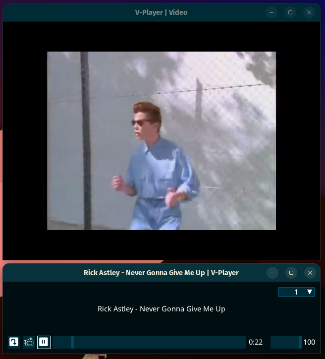
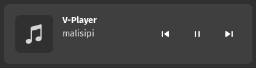

# V-Player - Media has never been this powerful

 

V-Player is a media player powered with V and MUI. The entire UI is written in V. The player uses system' web browser components and don't require any libraries except distributed with system.

* V-Player supports media keys and wire-less headphones
* Small executables
* Supports youtube videos¹
* Portable
* Windows 7+ and Linux supported
* Supports a lot of playback speed

 

* A system indicator to manage media from notifications area

¹: Requires youtube-dl

# License

This project licensed with GPL-3.
